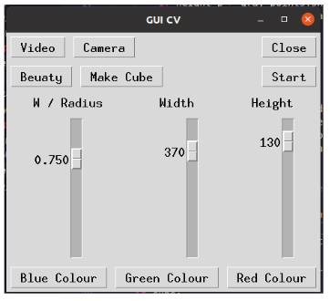
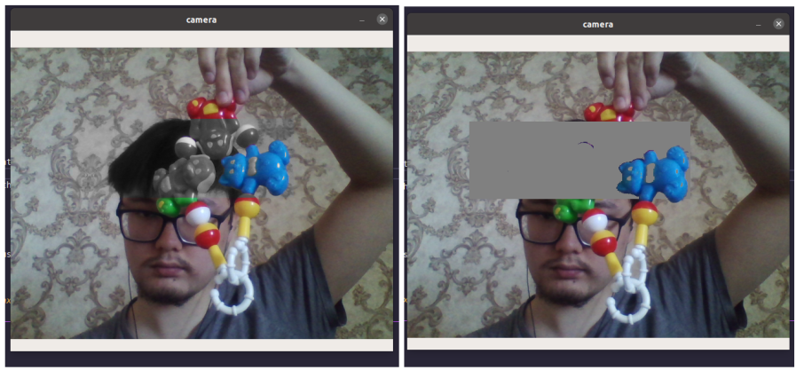
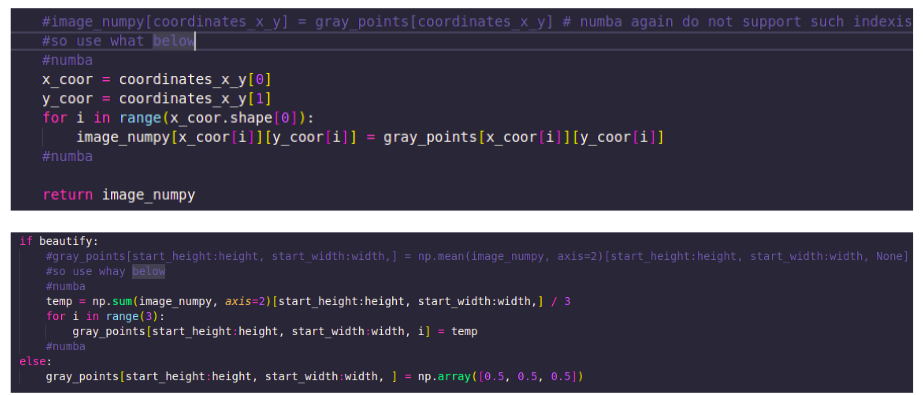

# selective_coloring
Selective Coloring effect implemented for Image Processing

# Used libraries: tkinter, numpy, cv2, numba.

# Implementation: 

</img>

To start the program, run the main.py. Here you can see two options for running: ‘Video’ and ‘Camera’. You can choose either video or camera. When one of them is opened in a separate window, you can close them by clicking the button ‘Close’ on GUI or by clicking ‘q’ if the video/camera window is selected. Video will itself shut down after all the frames were shown. Then, you can double click on any frame position of the video/camera window and it will save colors and position values of where you clicked. To apply the saved position and colors click ‘a’.  It will show in the log terminal what position and colors you choose. Then you can start the process of color slicing by clicking the start button and end by the same button. If you did not choose the position and clicked ‘a’, the default setting will be a blue color with a (0, 0) position. There are also three buttons at the bottom to choose basic colors for slicing. You can choose how to enclose colors of interest enclosed: by cube or sphere (default). In cube to change sensitivity they use W and in sphere radius. To make GUI more simple, I just connected both of the W and radius in one slider, because overall they will never be used at the same time because it is either cube or sphere mode (as shown in the two cases on the lecture slides). Button 'Beauty’ changes other colors to either plain gray or grayscale, so you can choose. By the way, all that you can do in real-time continuously. Width and height are for selecting the area around the selected pixel, either that you applied or default (0, 0). I think selecting the area in the task meant a slider for W / radius, but I added width and height additionally as bonus features. Also, beauty and making a cube/sphere also can be considered as a bonus. I decided instead of making a surprise bonus, I made all of that bonus control, which is nice.

# Results:

I selected the point (by double-clicking on the blue region of the toy and then pressing the ‘a’ button) a little above my eyes. The area's color was blue. You can see to the left is a beautified result with grayscale and the second is just plain gray.

</img>

# Problem Encountered:
For some reason, OpenCV (cv2) imshow works properly only in the main thread. In the different thread, it works for the first time good, but after you close it, in the same run, it will not show the images after you again open the camera. To solve this problem, I made GUI run in a separate thread and then call a video or camera loop in the main thread from the GUI thread. Another problem is that garbage collectors from the separate thread do not work properly, so I need to do it myself by gc.collect(). Now, it works fine. Another problem is the frame rate. It is okay but can be much better and color slicing can be accelerated. I used only numpy inside the function and no python loop, so I vectorized it, but still can be better. To accelerate the program I used a decorator from numba, which optimizes the python compiler by a lot. If for some reason, numba does not work in your pc, in process.py take the first line out of the comments and delete (or put in comments) everything between #numba. I used loops for numba because some of the operations such as advanced slicing it do not support, but even with loops, it gave a much higher frame rate than only vectorized numpy.

</img>
